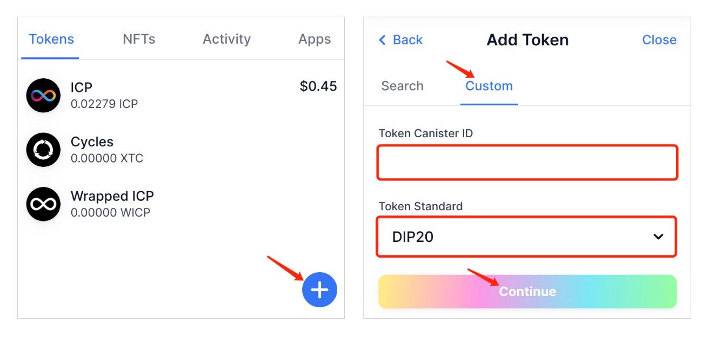

# Implemented DRC20 extension on DIP20

This standard follows the [CTSNC](https://github.com/iclighthouse/DRC_standards/tree/main/CTSNC) rules and extends the [DRC20 standard](https://github.com/iclighthouse/DRC_standards/tree/main/DRC20) (prefix "drc20_") on the basis of the [DIP20 standard](https://github.com/Psychedelic/DIP20).

## How to display the dip20-drc20 token in Plug.

Add token --> Custom --> Fill in Token Canister ID and select "DIP20" --> Continue --> ...

## Update:

[2022-8-11] Compatible with [ICRC-1 standard](https://github.com/dfinity/ICRC-1).

   

