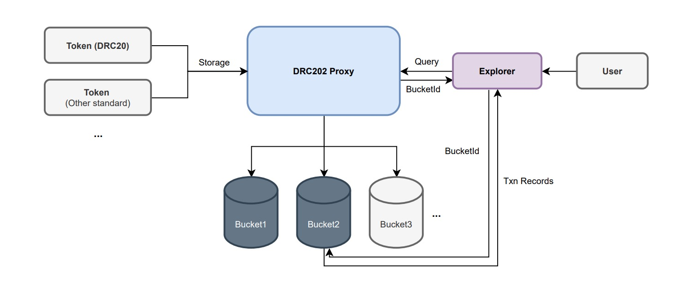

***
DRC: 202  
Title: Token Transaction Records Storage Standard  
Author: Avida <avida.life@hotmail.com>, Simpson <icpstaking-wei@hotmail.com>  
Status: Stable  
Category: Token DRC  
Created: 2021-12-10
***

## Abstract

DRC202 is a standard for scalable storage of token transaction records. It supports multi-token storage, automatic scaling to create storage canisters (buckets), and automatic routing of query records.



## Motivation

Since the storage capacity of canister is limited, a scalable external storage solution for tokens needs to be developed.

The DRC202 standard consists of three parts.

* Token transaction record data structure (TxnRecord): Defines a generic data structure suitable for different standards of token, taking into account data transparency and privacy protection.

* Scalable storage interface specification: Scalable storage mechanism is made up of an entry contract Proxy and multiple auto-scaling storage contracts Buckets. Proxy creates buckets according to the actual storage requirements (a new Bucket is created when one is full), and then compresses the transaction records and stores them in the Bucket. When you want to query a transaction record, you can first query the bucketId where the record is stored from the Proxy contract (using BloomFilter technology for routing, https://en.wikipedia.org/wiki/Bloom_filter ), and then query the transaction record from the specified Bucket.

* Dapp Development Kits (Motoko Module) & Guide: It is recommended that token developers adopt a transaction record storage specification that takes the model of "recent records cached in the current Canister + historical records persistently stored in the external Canister" and provides a query interface.


## Development Guide

https://github.com/iclighthouse/DRC_standards/blob/main/DRC202/dev-guide.md


## Specification

**NOTES**:

- The following specifications use syntax from Candid.
- The `Sid` is the globally unique transaction record storage ID, Blob type, 28 bytes, generated by the Proxy contract.
- The `Txid` is a unique transaction record ID within a token, Blob type, SHOULD be 8 or 32 bytes, generated by the token contract. Recommended method of generating txid: [DRC202.generateTxid(_token: Principal, _caller: AccountId, _nonce: Nat)](https://github.com/iclighthouse/DRC_standards/blob/main/DRC202/examples/ICLighthouse/Example/lib/DRC202Types.mo)。
    If you use Nat as txid, please convert Nat to Nat64 and then use big-endian encoding to generate 8-byte binary.
- The `AccountId` is the user's identity ID, usually a 32-byte Blob type, generated by the Token contract. If you use types such as Principal, [Nat8], etc., you NEEDs to convert it to AccountId (Blob). If it is an ICRC1 standard Account type, it needs to be converted to AccountId (Blob).

### Types (DID)

``` candid
type TxnRecord = record {
   caller: AccountId;
   gas: Gas;
   index: nat;
   msgCaller: opt principal;
   nonce: nat;
   timestamp: Time;
   transaction: Transaction;
   txid: Txid;
};
type Transaction = record {
   data: opt blob;
   from: AccountId;
   operation: Operation;
   to: AccountId;
   value: nat;
};
type Operation = variant {
   approve: record {allowance: nat;};
   executeTransfer: record { fallback: nat; lockedTxid: Txid; };
   lockTransfer: record { decider: AccountId; expiration: Time; locked: nat; };
   transfer: record {action: variant { burn; mint; send; };};
};
type AccountId = blob;
type Txid = blob;
type TokenInfo = record {count: nat; lastIndex: nat; lastTxid: Txid; };
type Token = principal;
type Time = int;
type Gas = variant { cycles: nat; noFee; token: nat;};
type BucketInfo = record {
   count: nat;
   cycles: nat;
   heap: nat;
   memory: nat;
   stableMemory: nat32;
};
type Bucket = principal;
```

### Generic storage interfaces (Proxy and Bucket)

#### 1. DRC202Proxy

DRC202Proxy is a proxy canister for transaction record storage that automatically creates and manages Bucket canisters.

#### standard

Returns standard name.  
OPTIONAL - This method can be used to improve usability, but the method may not be present.

``` candid
standard: () -> (text) query;
```

#### version

Returns version value.  
OPTIONAL - This method can be used to improve usability, but the method may not be present.

``` candid
version: () -> (nat8) query;
```

#### fee

Returns the fee (cycles) to be paid for storing a transaction record. Pay once for permanent storage.

``` candid
fee: () -> (cycles: nat) query;
```

#### storeBatch

Batch storage of records, allowing storage at intervals of more than 20 seconds. Calling this method requires adding cycles as a cost (fee is queried via the `fee()` method), and batch storage of n messages requires paying n*fee Cycles.

``` candid
storeBatch: (_txns: vec TxnRecord) -> ();
```

#### storeBytesBatch

Batch storage of binary records, allowing storage at intervals of more than 20 seconds. Calling this method requires adding cycles as a cost (fee is queried via the `fee()` method), and batch storage of n messages requires paying n*fee Cycles.

``` candid
storeBytesBatch: (_txns: vec record { Txid; vec nat8 }) -> ();
```

#### getLastTxns

Returns the latest stored transaction records. 

``` candid
getLastTxns: () -> (vec record { index: nat; token: Token; indexInToken: nat; txid: Txid; }) query;
```

#### location

Returns the Bucket where the transaction record for the given _token and _arg(txid, index or accountId) is located. returns the empty array if it does not exist; if the return value contains multiple values, it means that the transaction record may be stored in one of the Buckets and can be traversed to find it.

``` candid
location: (_token: Token, _arg: variant{ txid: Txid; index: nat; account: AccountId}, _version: opt nat8) -> (vec Bucket) query;
```

#### generateTxid

Generates txid based on the given token `_token`, accountId `_caller`, nonce `_nonce` values.   
OPTIONAL - This method can be used to improve usability, but the method may not be present.

``` candid
generateTxid: (_token: Token, _caller: AccountId, _nonce: nat) -> (Txid) query;
```

#### stats

Returns statistics.  
OPTIONAL - This method can be used to improve usability, but the method may not be present.

``` candid
stats: () -> (record { bucketCount: nat; errCount: nat; storeErrPool: nat; tokenCount: nat; txnCount: nat; }) query;
```

#### bucketList

Returns bucket list.  
OPTIONAL - This method can be used to improve usability, but the method may not be present.

``` candid
bucketList : () -> (vec Bucket) query;
```

#### setStd

Set the standard names of the `_token` implementation, such as "dip20; drc20", lowercase letters, multiple standard names split by "; ", following the [CTSNC](https://github.com/iclighthouse/DRC_standards/tree/main/CTSNC) rules.

``` candid
setStd(_stds: Text) : async ()
```

#### tokenInfo

Returns the standard name and statistics about the token `_token`.     
OPTIONAL - This method can be used to improve usability, but the method may not be present.

``` candid
tokenInfo : (_token: Token) -> (opt text, opt TokenInfo) query;
```


#### 2. DRC202Bucket

DRC202Bucket is used to store transaction record data and to implement the public query interface.

#### txn

Returns the transaction record for the specified `_token` and `_txid`.

``` candid
txn: (_token: Token, _txid: Txid) -> (opt record { TxnRecord; Time; }) query;
```

#### txnHistory

Returns the transaction record for the specified `_token` and `_txid`. Returns an array containing the history of all modifications.  

``` candid
txnHistory: (_token: Token, _txid: Txid) -> (vec record { TxnRecord; Time; }) query;
```

#### txnBytes

Returns the binary data of the transaction record for the specified `_token` and `_txid`. 

``` candid
txnBytes: (_token: Token, _txid: Txid) -> (opt record { vec nat8; Time; }) query;
```

#### txnBytesHistory

Returns the binary data of the transaction record for the specified `_token` and `_txid`. Returns an array containing the history of all modifications.  

``` candid
txnBytesHistory: (_token: Token, _txid: Txid) -> (vec record { vec nat8; Time; }) query;
```


#### txnByIndex

Returns a set of transaction history records for the specified `_token` and `_blockIndex`.     
OPTIONAL - This method can be used to improve usability, but the method may not exist.

``` candid
txnByIndex: (_token: Token, _blockIndex: nat) -> (vec record{TxnRecord; Time}) query;
```

#### txnByAccountId

Returns a set of transaction records for the specified `_accountId` and `_token`. Note: _page starts from 1.     
OPTIONAL - This method can be used to improve usability, but the method may not exist.

``` candid
txnByAccountId: (_accountId: AccountId, _token: opt Token, _page: opt nat32, _size: opt nat32) -> (vec vec record{TxnRecord; Time}) query;
```

#### txnHash

Generate the hash value of the specified transaction record.     
OPTIONAL - This method can be used to improve usability, but the method may not be present.
``` candid
txnHash: (_token: Token, _txid: Txid, _index: nat) -> (opt text) query;
```

#### txnBytesHash

Generate the hash value of the specified bytes data record.     
OPTIONAL - This method can be used to improve usability, but the method may not be present.
``` candid
txnBytesHash: (_token: Token, _txid: Txid, _index: nat) -> (opt text) query;
```

#### bucketInfo 

Returns information about the current bucket.   
OPTIONAL - This method can be used to improve usability, but the method may not be present.

``` candid
bucketInfo: () -> (BucketInfo) query;
```


#### 3. Token Interface (Implementation)

Token developers should implement the following interface in Token to facilitate querying transaction records.

#### drc202_canisterId

Returns DRC202Proxy canister-id。

``` candid
drc202_canisterId: () -> (principal) query;
```

#### drc202_events

Returns the transaction records for the specified account `Address`. If Address is not specified means to query all latest transaction records. Address is of type Text, is Principal or AccountId, e.g. "tqnrp-pjc3b-jzsc2-fg5tr-...-ts5ax-lbebt-uae", "1af2d0af449ab5a13e30...ee1f99a9ece5ceaf8fe4".

``` candid
drc202_events: (opt Address) -> (vec TxnRecord) query;
```

#### drc202_txn

Returns the transaction records in the token canister cache for the specified `Txid`. To query the transaction records stored in DRC202, use the [Developer's Guide](https://github.com/iclighthouse/DRC_standards/blob/main/DRC202/dev-guide.md).

``` candid
drc202_txn: (Txid) -> (opt TxnRecord) query;
```

### Development Kits (Motoko Module) & Guides

#### DRC202 Module

import DRC202 "lib/DRC202";

#### drc202

Returns the DRC202Proxy Canister object.  

``` candid
drc202: () -> DRC202Types.Self;
```

#### drc202CanisterId

Returns the DRC202Proxy canister-id.

``` candid
drc202CanisterId: () -> principal;
```

#### config

Configure the properties EN_DEBUG, MAX_CACHE_TIME, MAX_CACHE_NUMBER_PER, MAX_STORAGE_TRIES, etc.  

``` candid
config: (_config: Config) -> bool;
```

#### getConfig

Returns the configuration information. 

``` candid
getConfig: () -> Setting;
```

#### generateTxid

Generates txid. 

``` candid
generateTxid : (_app: principal, _caller: AccountId, _nonce: nat) -> Txid;
```

#### pushLastTxn

Store the `_txid` record of the user associated with the transaction. 

``` candid
pushLastTxn : (_as: vec AccountId, _txid: Txid) -> ();
```

#### inLockedTxns

Determines if `_txid` is in the list of locked transactions for the specified account. 

``` candid
inLockedTxns : (_txid: Txid, _a: AccountId) -> bool;
```

#### getLockedTxns

Returns a list of locked transaction txid for the specified account `_account`.

``` candid
getLockedTxns : (_account: AccountId) -> vec Txid;
```

#### appendLockedTxn

Stores `_txid` of locked transaction for account `_account`.

``` candid
appendLockedTxn : (_account: AccountId, _txid: Txid) -> ();
```

#### dropLockedTxn

Removes the `_txid` of locked transaction for account `_account` from the list. 

``` candid
dropLockedTxn : (_account: AccountId, _txid: Txid) -> ();
```

#### get

Finds the record with the specified `_txid` from the current canister cache, or returns null if it does not exist. 

``` candid
get : (_txid: Txid) -> opt TxnRecord;
```

#### put

Caches a record `_txn`.

``` candid
put : (_txn: TxnRecord) -> ();
```

#### store

Asynchronously stores a record into the extended Canister. 

``` candid
store : () -> ();
```
#### get2

Finds the record with the specified `_txid` from the current canister cache, or finds the record from the external canister if it does not exist. This is an asynchronous method.  

``` candid
get : (_txid: Txid) -> opt TxnRecord;
```

#### getLastTxns

Returns a list of latest records txid for account `_account`.  

``` candid
getLastTxns : (_account: opt AccountId) -> vec Txid;
```

#### getEvents

Returns a list of details of the latest records that occurred for account `_account`.

``` candid
getEvents : (_account: opt AccountId) -> vec TxnRecord;
```

#### getData

Returns the data of the drc202 object, which is only used for data backup during upgrade.  

``` candid
getData : () -> DataTemp;
```

#### setData

Sets the data of the drc202 object, which is used only for upgrades.  

``` candid
setData : (_data: DataTemp) -> ();
```


#### Developer's Guide 

Motoko development example: https://github.com/iclighthouse/DRC_standards/blob/main/DRC202/examples/ICLighthouse/Example/Example.mo

**Step1** Importing module files

Puts the folder https://github.com/iclighthouse/DRC_standards/blob/main/DRC202/examples/ICLighthouse/Example/lib/  into your project directory, and import modules into your code.
``` motoko
import Array "mo:base/Array";
import Principal "mo:base/Principal";
import Time "mo:base/Time";
import DRC202 "lib/DRC202";
``` 

**Step2** Writing codes

Declare private global variables, e.g.
``` motoko
// Set EN_DEBUG=false in the production environment.
private var drc202 = DRC202.DRC202({EN_DEBUG = true; MAX_CACHE_TIME = 3 * 30 * 24 * 3600 * 1000000000; MAX_CACHE_NUMBER_PER = 100; MAX_STORAGE_TRIES = 2; });
``` 

Generates Txid and TxnRecord, execute drc202.put(txn) to store the record into the cache, and execute drc202.store() to store the record into the DRC202 storage canister, e.g.
``` motoko
    public shared(msg) func test(_n: Nat) : async DRC202.Txid{
        let caller = drc202.getAccountId(msg.caller, null);
        let from = drc202.getAccountId(msg.caller, null);
        let to = drc202.getAccountId(Principal.fromText("aaaaa-aa"), null);
        let txid = drc202.generateTxid(Principal.fromActor(this), caller, _n);
        var txn: DRC202.TxnRecord = {
            txid = txid; // Transaction id
            transaction = {
                from = from; // from
                to = to; //to
                value = 100000000; // amount
                operation = #transfer({ action = #send }); // DRC202.Operation;
                data = null; // attached data(Blob)
            };
            gas = #token(10000); // gas
            msgCaller = null;  // Caller principal
            caller = caller; // Caller account (Blob)
            index = _n; // Global Index
            nonce = _n; // Nonce of user
            timestamp = Time.now(); // Timestamp (nanoseconds).
        };
        drc202.put(txn); // Put txn to the current canister cache.
        drc202.pushLastTxn([from, to], txid); // Put txid to LastTxn cache.
        let store = /*await*/ drc202.store(); // Store in the DRC202 scalable bucket.
        return txid;
    };
``` 

**Step3** Writing queries and upgrade functions

It is recommended to implement the following methods in your token. (Convenient ic.house explorer query records)

* drc202_getConfig : () -> DRC202.Setting query
* drc202_canisterId : () -> principal query
* drc202_events : (_account: opt DRC202.Address) -> vec DRC202.TxnRecord query
* drc202_txn : (_txid: DRC202.Txid) -> opt DRC202.TxnRecord query
* drc202_txn2 : (_txid: DRC202.Txid) -> opt DRC202.TxnRecord

E.g.
``` motoko
    public query func drc202_getConfig() : async DRC202.Setting{
        return drc202.getConfig();
    };
    public query func drc202_canisterId() : async Principal{
        return drc202.drc202CanisterId();
    };
    /// config
    // public shared(msg) func drc202_config(config: DRC202.Config) : async Bool{ 
    //     assert(msg.caller == owner);
    //     return drc202.config(config);
    // };
    /// returns events
    public query func drc202_events(_account: ?DRC202.Address) : async [DRC202.TxnRecord]{
        switch(_account){
            case(?(account)){ return drc202.getEvents(?drc202.getAccountId(Principal.fromText(account), null)); };
            case(_){return drc202.getEvents(null);}
        };
    };
    /// returns txn record. It's an query method that will try to find txn record in token canister cache.
    public query func drc202_txn(_txid: DRC202.Txid) : async (txn: ?DRC202.TxnRecord){
        return drc202.get(_txid);
    };
    /// returns txn record. It's an update method that will try to find txn record in the DRC202 canister if the record does not exist in this canister.
    public shared func drc202_txn2(_txid: DRC202.Txid) : async (txn: ?DRC202.TxnRecord){
        return await drc202.get2(Principal.fromActor(this), _txid);
    };
    // upgrade
    private stable var __drc202Data: [DRC202.DataTemp] = [];
    system func preupgrade() {
        __drc202Data := Array.append(__drc202Data, [drc202.getData()]);
    };
    system func postupgrade() {
        if (__drc202Data.size() > 0){
            drc202.setData(__drc202Data[0]);
            __drc202Data := [];
        };
    };
```

## Implementation


#### Example implementations

- Storage Canister: https://github.com/iclighthouse/DRC_standards/tree/main/DRC202/examples/ICLighthouse  
    ICTokens DRC202 (Main): y5a36-liaaa-aaaak-aacqa-cai  
    ICTokens DRC202 (Test): iq2ev-rqaaa-aaaak-aagba-cai  
    Notes: Use y5a36-liaaa-aaaak-aacqa-cai to store token records that can be queried through the ICHouse blockchain explorer (http://ic.house).

- Motoko Module: https://github.com/iclighthouse/DRC_standards/blob/main/DRC202/examples/ICLighthouse/Example/lib/DRC202.mo 

- Development Example: https://github.com/iclighthouse/DRC_standards/blob/main/DRC202/examples/ICLighthouse/Example/Example.mo  
