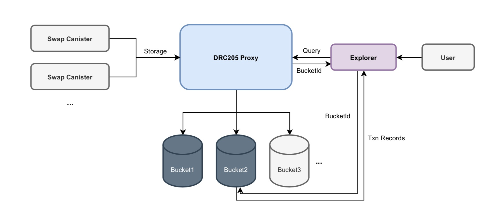

***
DRC: 205  
Title: Swap Transaction Records Storage Standard   
Author: Avida <avida.life@hotmail.com>, Simpson <icpstaking-wei@hotmail.com>  
Status: Draft  
Category: Swap DRC  
Created: 2021-12-10
***

## Abstract

DRC205 is a standard for scalable storage of swap transaction records. It supports multi-dex storage, automatic scaling to create storage canisters (buckets), and automatic routing of query records.



## Motivation

Dex's transaction records have a need to a persistent and transparent storage, and therefore require a scalable external storage solution.

The DRC205 standard consists of three parts.

* Swap transaction record data structure (TxnRecord): Defines a generic data structure that adapts to AMM and OrderBook schemas of Dex, taking into account data transparency and privacy protection.

* Scalable storage interface specification: Scalable storage mechanism is made up of an entry contract Proxy and multiple auto-scaling storage contracts Buckets. Proxy creates buckets according to the actual storage requirements (a new Bucket is created when one is full), and then compresses the transaction records and stores them in the Bucket. When you want to query a transaction record, you can first query the bucketId where the record is stored from the Proxy contract (using BloomFilter technology for routing, https://en.wikipedia.org/wiki/Bloom_filter ), and then query the transaction record from the specified Bucket.

* Dapp Development Kits (Motoko Module) & Guide: It is recommended that Dex developers adopt a transaction record storage specification that takes the model of "recent records cached in the current Canister + historical records persistently stored in the external Canister" and provides a query interface.


## Development Guide

https://github.com/iclighthouse/DRC_standards/blob/main/DRC205/dev-guide.md


## Specification

**NOTES**:

- The following specifications use syntax from Candid.
- The `Sid` is the globally unique transaction record storage ID, Blob type, 28 bytes, generated by the Proxy contract.
- The `Txid` is a unique transaction record ID within a dapp, Blob type, SHOULD be 8 or 32 bytes, generated by the dapp contract. Recommended method of generating txid: [DRC205.generateTxid(_app: Principal, _caller: AccountId, _nonce: Nat)](https://github.com/iclighthouse/DRC_standards/blob/main/DRC205/examples/ICLighthouse/Example/lib/DRC205Types.mo).
    If you use Nat as txid, please convert Nat to Nat64 and then use big-endian encoding to generate 8-byte binary.
- The `AccountId` is the user's identity ID, usually a 32-byte Blob type, generated by the Dex contract. If you use types such as Principal, [Nat8], etc., you NEEDs to convert it to AccountId (Blob). If the token of the pair is of the ICRC1 standard Account type, it needs to be converted to AccountId(Blob), the `msgCaller` field in the type `TxnRecord` is filled with the trader's `owner` and the `caller` field is filled with the trader's `subaccount`.

### Transaction Record Types (TxnRecord)

This is a recommended data structure. If you use a custom data structure, you can use the `storeBytesBatch` method to meet compatibility requirements.

``` candid
type Status = variant { Failed; Pending; Completed; PartiallyCompletedAndCancelled; Cancelled; };
type TxnRecord = record {
   account: AccountId;
   caller: AccountId;
   cyclesWallet: opt CyclesWallet;
   data: opt Data;
   details: vec record {
       counterparty: Txid;
       time: Time;
       token0Value: BalanceChange;
       token1Value: BalanceChange;
     };
   fee: record { token0Fee: int; token1Fee: int; };
   filled: record { token0Value: BalanceChange; token1Value: BalanceChange; };
   index: nat;
   msgCaller: opt principal;
   nonce: Nonce;
   operation: OperationType;
   order: record { token0Value: opt BalanceChange; token1Value: opt BalanceChange; };
   orderMode: variant { AMM; OrderBook; };
   orderType: opt variant { FAK; FOK; LMT; MKT; };
   shares: ShareChange;
   status: Status;
   time: Time;
   token0: TokenType;
   token1: TokenType;
   txid: Txid;
 };
type Txid = blob;
type TokenType = variant { Cycles; Icp; Token: principal; };
type Time = int;
type Shares = nat;
type ShareChange = variant { Burn: Shares; Mint: Shares; NoChange; };
type OperationType = variant { AddLiquidity; Claim; RemoveLiquidity; Swap; };
type Nonce = nat;
type Data = blob;
type CyclesWallet = principal;
type BucketInfo = record { count: nat;cycles: nat; heap: nat; memory: nat; stableMemory: nat32; };
type Bucket = principal;
type BalanceChange = variant { CreditRecord: nat; DebitRecord: nat; NoChange; };
type AppInfo = record { count: nat; lastIndex: nat; lastTxid: Txid; };
type AppId = principal;
type AccountId = blob;
```

Types in Motoko: https://github.com/iclighthouse/DRC_standards/blob/main/DRC205/examples/ICLighthouse/Example/lib/DRC205Types.mo

See development example annotations for field explanations: https://github.com/iclighthouse/DRC_standards/blob/main/DRC205/examples/ICLighthouse/Example/Example.mo

### Generic storage interfaces (Proxy and Bucket)

#### 1. DRC205Proxy

DRC205Proxy is a proxy canister for transaction record storage that automatically creates and manages Bucket canisters.

#### standard

Returns standard name.  
OPTIONAL - This method can be used to improve usability, but the method may not be present.

``` candid
standard: () -> (text) query;
```

#### version

Returns version value.  
OPTIONAL - This method can be used to improve usability, but the method may not be present.

``` candid
version: () -> (nat8) query;
```

#### fee

Returns the fee (cycles) to be paid for storing a transaction record. Pay once for permanent storage.

``` candid
fee: () -> (cycles: nat) query;
```

#### storeBatch

Batch storage of transaction records, allowing storage at intervals of more than 20 seconds. Calling this method requires adding cycles as a cost (fee is queried via the `fee()` method), and batch storage of n messages requires paying n*fee Cycles.

``` candid
storeBatch: (_txns: vec TxnRecord) -> ();
```

#### storeBytesBatch

Batch storage of binary records, allowing storage at intervals of more than 20 seconds. Calling this method requires adding cycles as a cost (fee is queried via the `fee()` method), and batch storage of n messages requires paying n*fee Cycles.

``` candid
storeBytesBatch: (_txns: vec record { Txid; vec nat8 }) -> ();
```

#### getLastTxns

Returns the latest stored transaction records.

``` candid
getLastTxns: () -> (vec record { index: nat; app: AppId; indexInApp: nat; txid: Txid; }) query;
```

#### location

Returns the Bucket where the transaction record for the given _app and _arg(txid, index or accountId) is located. returns the empty array if it does not exist; if the return value contains multiple values, it means that the transaction record may be stored in one of the Buckets and can be traversed to find it.

``` candid
location: (_app: AppId, _arg: variant{ txid: Txid; index: nat; account: AccountId}, _version: opt nat8) -> (vec Bucket) query;
```

#### generateTxid

Generates txid based on the given app `_app`, accountId `_caller`, nonce `_nonce` values.  
OPTIONAL - This method can be used to improve usability, but the method may not be present.

``` candid
generateTxid: (_app: AppId, _caller: AccountId, _nonce: nat) -> (Txid) query;
```

#### stats

Returns statistics.  
OPTIONAL - This method can be used to improve usability, but the method may not be present.

``` candid
stats: () -> (record { bucketCount: nat; errCount: nat; storeErrPool: nat; tokenCount: nat; txnCount: nat; }) query;
```

#### bucketList

Returns bucket list.  
OPTIONAL - This method can be used to improve usability, but the method may not be present.

``` candid
bucketList : () -> (vec Bucket) query;
```


#### 2. DRC205Bucket

DRC205Bucket is used to store transaction record data and to implement the public query interface.

#### txn

Returns the transaction record for the specified `_app` and `_txid`.

``` candid
txn: (_app: AppId, _txid: Txid) -> (opt record { TxnRecord; Time; }) query;
```

#### txnHistory

Returns the transaction record for the specified `_app` and `_txid`. Returns an array containing the history of all modifications.  

``` candid
txnHistory: (_app: AppId, _txid: Txid) -> (vec record { TxnRecord; Time; }) query;
```

#### txnBytes

Returns the binary data of the transaction record for the specified `_app` and `_txid`. 

``` candid
txnBytes: (_app: AppId, _txid: Txid) -> (opt record { vec nat8; Time; }) query;
```

#### txnBytesHistory

Returns the binary data of the transaction record for the specified `_app` and `_txid`. Returns an array containing the history of all modifications.  

``` candid
txnBytesHistory: (_app: AppId, _txid: Txid) -> (vec record { vec nat8; Time; }) query;
```

#### txnByIndex

Returns a set of transaction history records for the specified `_app` and `_blockIndex`.     
OPTIONAL - This method can be used to improve usability, but the method may not exist.

``` candid
txnByIndex: (_app: AppId, _blockIndex: nat) -> (vec record{TxnRecord; Time}) query;
```

#### txnByAccountId

Returns a set of transaction records for the specified `_accountId` and `_app`. Note: _page starts from 1.     
OPTIONAL - This method can be used to improve usability, but the method may not exist.

``` candid
txnByAccountId: (_accountId: AccountId, _app: opt AppId, _page: opt nat32, _size: opt nat32) -> (record{data: vec vec record{TxnRecord; Time}; totalPage: nat; total: nat}) query;
```

#### txnHash

Generate the hash value of the specified transaction record.    
OPTIONAL - This method can be used to improve usability, but the method may not be present.
``` candid
txnHash: (_app: AppId, _txid: Txid, _index: nat) -> (opt text) query;
```

#### txnBytesHash

Generate the hash value of the specified bytes data record.    
OPTIONAL - This method can be used to improve usability, but the method may not be present.
``` candid
txnBytesHash: (_app: AppId, _txid: Txid, _index: nat) -> (opt text) query;
```

#### bucketInfo 

Returns information about the current bucket.   
OPTIONAL - This method can be used to improve usability, but the method may not be present.

``` candid
bucketInfo: () -> (BucketInfo) query;
```

#### 3. Trading Pair Interface (Implementation)

Dex developers should implement the following interface in trading pair to facilitate querying transaction records.

#### drc205_canisterId

Returns DRC205Proxy canister-id。

``` candid
drc205_canisterId: () -> (principal) query;
```

#### drc205_events

Returns the transaction records for the specified account `Address`. If Address is not specified means to query all latest transaction records. Address is of type Text, is Principal or AccountId, e.g. "tqnrp-pjc3b-jzsc2-fg5tr-...-ts5ax-lbebt-uae", "1af2d0af449ab5a13e30...ee1f99a9ece5ceaf8fe4".

``` candid
drc205_events: (opt Address) -> (vec TxnRecord) query;
```

#### drc205_txn

Returns the transaction records in the token canister cache for the specified `Txid`. To query the transaction records stored in DRC205, use the [Developer's Guide](https://github.com/iclighthouse/DRC_standards/blob/main/DRC205/dev-guide.md).

``` candid
drc205_txn: (Txid) -> (opt TxnRecord) query;
```


### Development Kits (Motoko Module) & Guides

#### DRC205 Module

import DRC205 "lib/DRC205";

#### drc205

Returns the DRC205Proxy Canister object.   

``` candid
drc205: () -> DRC205Types.Self;
```

#### drc205CanisterId

Returns DRC205Proxy canister-id。 

``` candid
drc205CanisterId: () -> principal;
```

#### config

Configure the properties EN_DEBUG, MAX_CACHE_TIME, MAX_CACHE_NUMBER_PER, MAX_STORAGE_TRIES, etc.

``` candid
config: (_config: Config) -> bool;
```

#### getConfig

Returns the configuration information. 

``` candid
getConfig: () -> Setting;
```

#### generateTxid

Generates the txid. 

``` candid
generateTxid : (_app: principal, _caller: AccountId, _nonce: nat) -> Txid;
```

#### get

Finds the record with the specified `_txid` from the current canister cache, or returns null if it does not exist. 

``` candid
get : (_txid: Txid) -> opt TxnRecord;
```

#### put

Caches a record `_txn`.

``` candid
put : (_txn: TxnRecord) -> ();
```

#### store

Asynchronously stores a record into the extended Canister. 

``` candid
store : () -> ();
```
#### get2

Finds the record with the specified `_txid` from the current canister cache, or finds the record from the external canister if it does not exist. This is an asynchronous method.  

``` candid
get : (_txid: Txid) -> opt TxnRecord;
```

#### getLastTxns

Returns a list of latest records txid for user `_account`.  

``` candid
getLastTxns : (_account: opt AccountId) -> vec Txid;
```

#### getEvents

Returns a list of details of the latest records that occurred for user `_account`.

``` candid
getEvents : (_account: opt AccountId) -> vec TxnRecord;
```

#### getData

Returns the data of the drc205 object, which is only used for data backup during upgrade.  

``` candid
getData : () -> DataTemp;
```

#### setData

Sets the data of the drc205 object, which is used only for upgrades.  

``` candid
setData : (_data: DataTemp) -> ();
```

#### Rust Developer's Guide

DRC205 (Main): 6ylab-kiaaa-aaaak-aacga-cai  
DRC205 (Test): ix3cb-4iaaa-aaaak-aagbq-cai  

Refer to the Candid file interface at

https://github.com/iclighthouse/DRC_standards/blob/main/DRC205/DRC205Proxy.did  
https://github.com/iclighthouse/DRC_standards/blob/main/DRC205/DRC205Bucket.did  

Please call the storeBatch or storeBytesBatch method for batch storage, paying attention to adding Cycles and the time interval between calls.


#### Motoko Developer's Guide 

DRC205 (Main): 6ylab-kiaaa-aaaak-aacga-cai  
DRC205 (Test): ix3cb-4iaaa-aaaak-aagbq-cai 

Motoko development example: https://github.com/iclighthouse/DRC_standards/blob/main/DRC205/examples/ICLighthouse/Example/Example.mo

**Step1** Importing module files

Puts the folder https://github.com/iclighthouse/DRC_standards/blob/main/DRC205/examples/ICLighthouse/Example/lib/ into your project directory, and import modules into your code.
``` motoko
import Array "mo:base/Array";
import Principal "mo:base/Principal";
import Time "mo:base/Time";
import DRC205 "lib/DRC205";
``` 

**Step2** Writing codes

Declare private global variables, e.g.
``` motoko
// Set EN_DEBUG=false in the production environment.
private var drc205 = DRC205.DRC205({EN_DEBUG = true; MAX_CACHE_TIME = 3 * 30 * 24 * 3600 * 1000000000; MAX_CACHE_NUMBER_PER = 100; MAX_STORAGE_TRIES = 2; });
``` 

Generates Txid and TxnRecord, execute drc205.put(txn) to store the record into the cache, and execute drc205.store() to store the record into the DRC205 storage canister, e.g.
``` motoko
    public shared(msg) func test(_n: Nat) : async DRC205.Txid{
        let caller = drc205.getAccountId(msg.caller, null);
        let txid = drc205.generateTxid(Principal.fromActor(this), caller, _n);
        var txn: DRC205.TxnRecord = {
            txid = txid; // Transaction id
            msgCaller = null; // Caller principal
            caller = caller; // Caller account (Blob)
            operation = #Swap; // { #AddLiquidity; #RemoveLiquidity; #Claim; #Swap; }
            account = caller; // Swap user account (Blob)
            cyclesWallet = null; // Cycles wallet principal, used only for one of trading pair tokens is cycles.
            token0 = #Token(Principal.fromText("ueghb-uqaaa-aaaak-aaioa-cai")); // Trading pair { #Cycles; #Icp; #Token: Principal; }
            token1 = #Token(Principal.fromText("udhbv-ziaaa-aaaak-aaioq-cai")); // Trading pair { #Cycles; #Icp; #Token: Principal; }
            token0Value = #DebitRecord(10000000000); // #DebitRecord indicates the amount of token0 spent for swapping.
            token1Value = #CreditRecord(20000000000); // #CreditRecord indicates the amount of token1 received from swapping.
            fee = {token0Fee = 0; token1Fee = 20000; }; // fee
            shares = #NoChange; // Liquidity shares change of user. { #Mint: Nat; #Burn: Nat; #NoChange; }
            time = Time.now(); // Timestamp (nanoseconds).
            index = _n;  // Global Index
            nonce = _n;  // Nonce of user
            orderType = #AMM; // Order Type  { #AMM; #OrderBook; }
            details = []; // Counterparty order list, for orderbook mode only.
            data = null; // Attached data (Blob)
        };
        drc205.put(txn); // Put txn to the current canister cache.
        let store = /*await*/ drc205.store(); // Store in the DRC205 scalable bucket.
        return txid;
    };
``` 

**Step3** Writing queries and upgrade functions

It is recommended to implement the following methods in your dapp. (Convenient ic.house explorer query records)

* drc205_getConfig : () -> DRC205.Setting query
* drc205_canisterId : () -> principal query
* drc205_dexInfo : () -> async DRC205.DexInfo query
* drc205_events : (_account: opt DRC205.Address) -> vec DRC205.TxnRecord query
* drc205_txn : (_txid: DRC205.Txid) -> opt DRC205.TxnRecord query
* drc205_txn2 : (_txid: DRC205.Txid) -> opt DRC205.TxnRecord

E.g.
``` motoko
    /// returns setting
    public query func drc205_getConfig() : async DRC205.Setting{
        return drc205.getConfig();
    };
    public query func drc205_canisterId() : async Principal{
        return drc205.drc205CanisterId();
    };
    public query func drc205_dexInfo() : async DRC205.DexInfo{
        return {
            canisterId = Principal.fromActor(this);
            dexName = "icswap"; // your dex name
            pairName = "TEKENA/TOKENB"; // pair name
            token0 = (#Token(Principal.fromText("ueghb-uqaaa-aaaak-aaioa-cai")), #drc20); // token0 info
            token1 = (#Token(Principal.fromText("udhbv-ziaaa-aaaak-aaioq-cai")), #dip20); // token1 info
            feeRate = 0.005; // fee rate
        };
    };
    /// config
    // public shared(msg) func drc205_config(config: DRC205.Config) : async Bool{ 
    //     assert(msg.caller == owner);
    //     return drc205.config(config);
    // };
    /// returns events
    public query func drc205_events(_account: ?DRC205.Address) : async [DRC205.TxnRecord]{
        switch(_account){
            case(?(account)){ return drc205.getEvents(?drc205.getAccountId(Principal.fromText(account), null)); };
            case(_){return drc205.getEvents(null);}
        };
    };
    /// returns txn record. This is a query method that looks for record from this canister cache.
    public query func drc205_txn(_txid: DRC205.Txid) : async (txn: ?DRC205.TxnRecord){
        return drc205.get(_txid);
    };
    /// returns txn record. It's an update method that will try to find txn record in the DRC205 canister if the record does not exist in this canister.
    public shared func drc205_txn2(_txid: DRC205.Txid) : async (txn: ?DRC205.TxnRecord){
        return await drc205.get2(Principal.fromActor(this), _txid);
    };
    // upgrade
    private stable var __drc205Data: [DRC205.DataTemp] = [];
    system func preupgrade() {
        __drc205Data := Array.append(__drc205Data, [drc205.getData()]);
    };
    system func postupgrade() {
        if (__drc205Data.size() > 0){
            drc205.setData(__drc205Data[0]);
            __drc205Data := [];
        };
    };
```


## Examples

#### Implementations

- Storage Canister: https://github.com/iclighthouse/DRC_standards/tree/main/DRC205/examples/IClighthouse  
    DRC205 (Main): 6ylab-kiaaa-aaaak-aacga-cai  
    DRC205 (Test): ix3cb-4iaaa-aaaak-aagbq-cai  
    **Notes**: Use 6ylab-kiaaa-aaaak-aacga-cai to store swap records that can be queried through the ICHouse blockchain explorer (http://ic.house).

- Motoko Module: https://github.com/iclighthouse/DRC_standards/blob/main/DRC205/examples/ICLighthouse/Example/lib/DRC205.mo 

- Development Example: https://github.com/iclighthouse/DRC_standards/blob/main/DRC205/examples/ICLighthouse/Example/Example.mo   